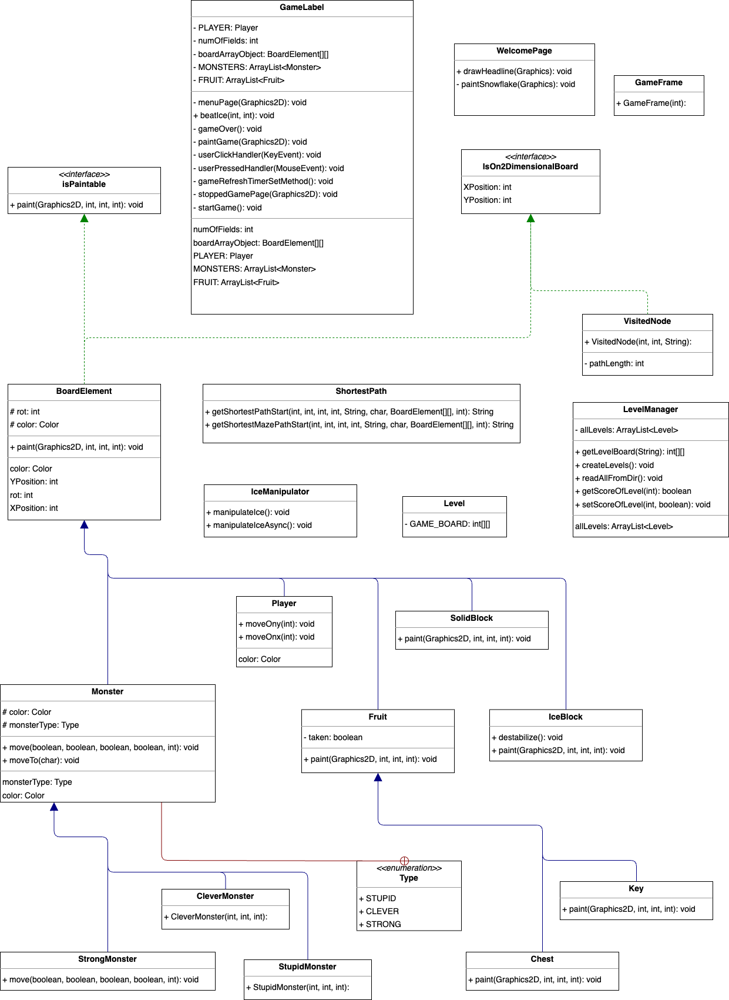
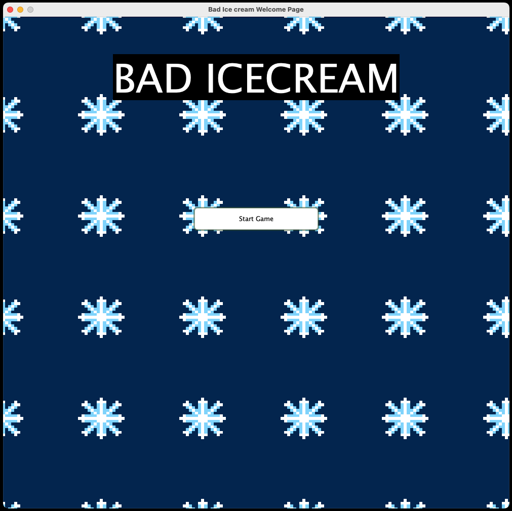
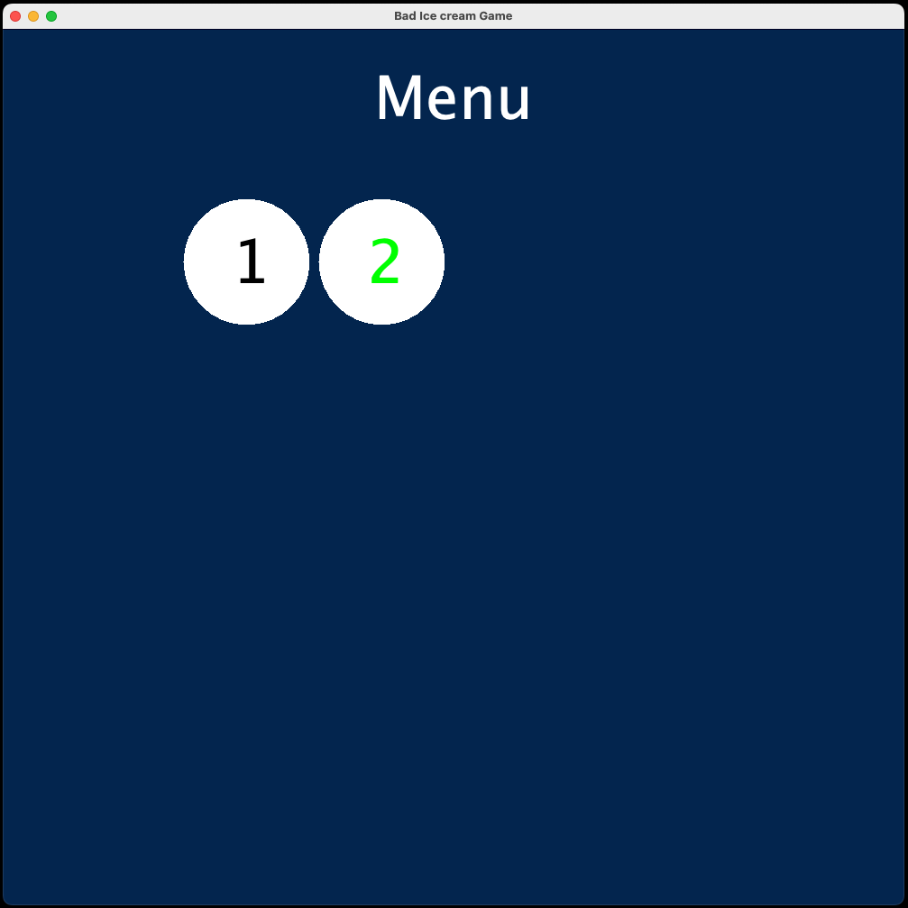
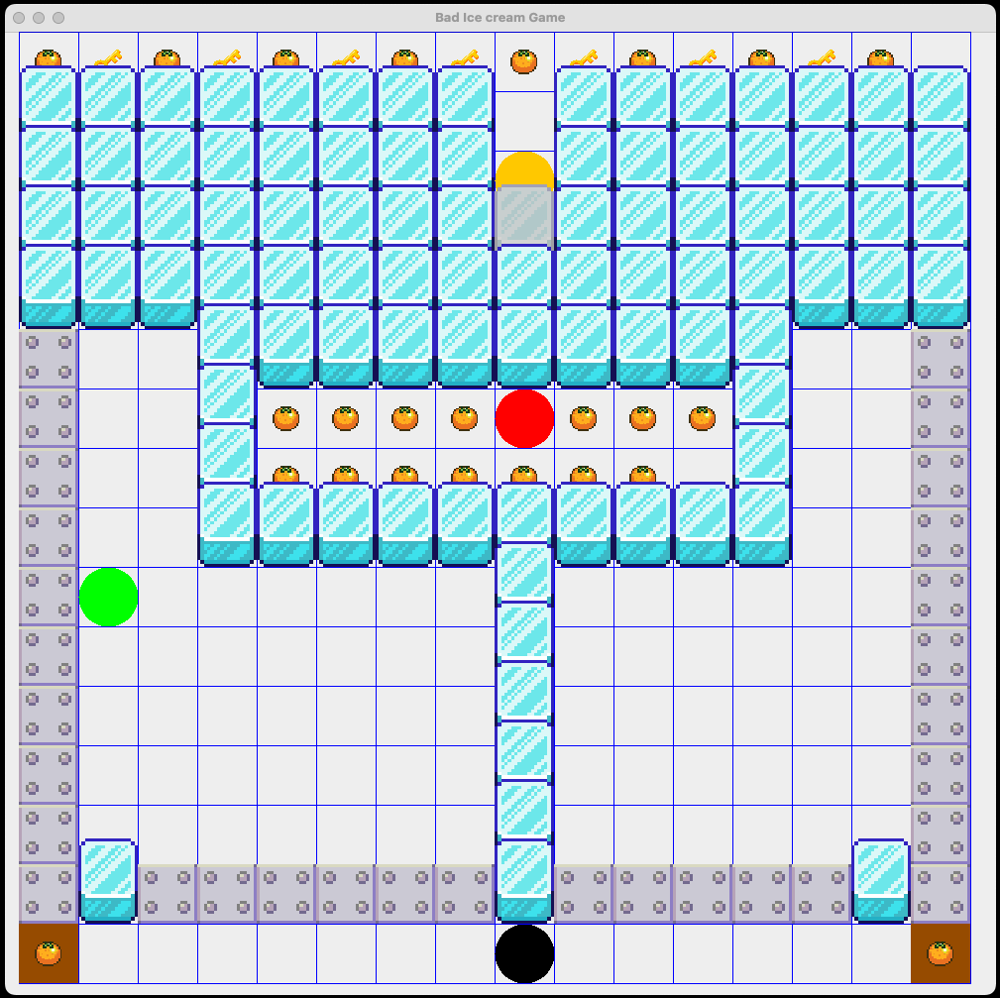
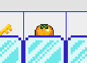
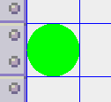
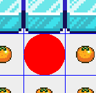
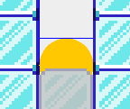
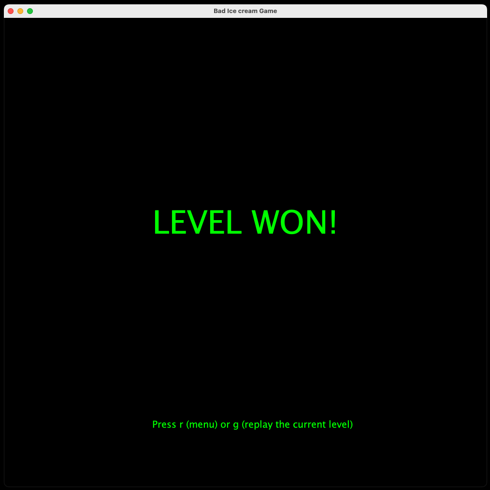
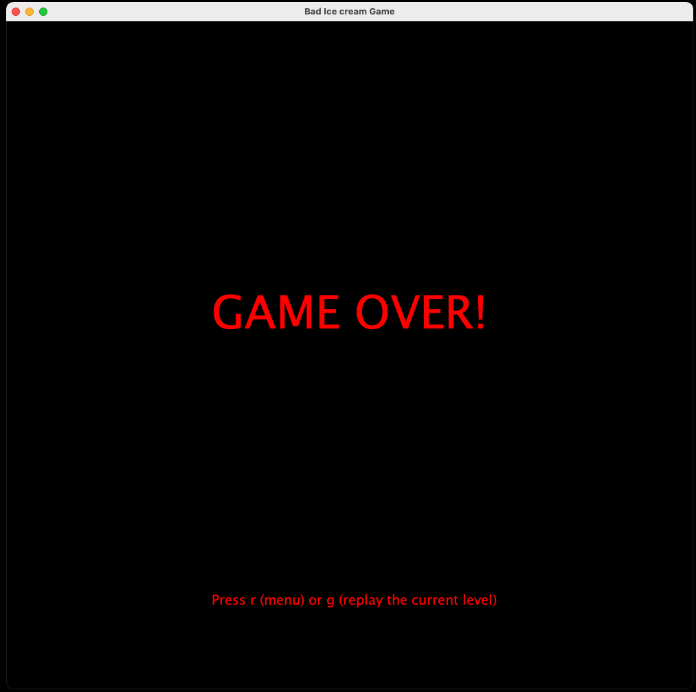

# Bad Ice Cream Java Game Engine
This is a repository for Java Bad Ice Cream Game, 
this game was created as a pet project.  
The idea of this game is very similar to the Bad Ice Cream that can be found on friv
or other online games websites. There are multiple versions of the original Bad Ice
Cream Game. I am inspired by the first edition which I played at my high school.  

# UML - Software Object Model

Above you can see the object model written in an UML format. This diagram represents the
analytical object model with all the classes and their relationships. Some methods or
state atributes are not included as they are redundant redundant to be specified here.

# User Documentation
The github readme page serves as a User documentation(programmer documentation is 
also included). If you want to use my game and wanna know how to play it
this is the place for you. The functional side of the game will be explained here,
what buttons to press to move or to freeze(unfreeze) the blocks in the game.
I will also explain what find of monsters are you going to meet in the game and
how to survive and not get killed.

## How to start the game

When you open the game you will see the welcome window page, in this page 
there is an animation of snowflakes falling as well as the Bad Ice cream headline.
This page is there to welcome you into the game and to give you as the player the felling 
of stepping into the freezing realm.  
On the welcome page there is also a Start Game button. When pressed this button 
transfers you to the game menu with all the levels of the game. Once pressed you can never return to the welcome page
as the welcome page is there to welcome you. 

## Menu Page

When you press the Start Game button on the Welcome page you are moved to the manu page.
This page is here for you to pick the levels you wanna play or to see which levels are already passed or not yet passed.
Levels colored by green color are the ones passed, those colored by the black color
are the ones not passed.  
Levels are white balls with number of level inside of them, representing their count as there could be more levels
(more on this in the programmer documentation, as levels are automatically generated from the csv files).  
You can click on the level and the game will be running.

## Game

Once the level button is pressed the game is on and running. You will be moving
by with the arrows on your keyboard. You can also freeze or unfreeze the game tiles.
Freezing and unfreezing is realised by pressing the space bar. If the block just in front of you is 
an empty block you will freeze all the empty blocks infront of it, with the respect to rotation(will be explained later).
If the block in front is an ice block, you will be unfreezing all ice blocks.  
You as a player have a rotation, rotation is where your player is pointing towards. It is the last pressed arrow key on your keyboard.
So you cannot move thrue the ice blocks but if you try your rotation will change.
You are always freezing and unfreezing in the direction of your rotation.  

### Collecting the fruit
In order to win the level you cannot be killed by any monster and you have to collect all fruit.
Fruit can be collected by stepping on the same tile as the fruit is on, or in the case of
chested fruit you have to collect the keys as first.  

#### Fruit

Regular fruit is rendered as an orange with white background. This fruit can be
collected by stepping on the same tile as it is located on. When you as a player step on the same
tile the fruit will be collected automatically, all fruit will have to be collected
in order to win the level.

#### Chested Fruit

Chested is a special type of fruit, and the fruit is hidden inside of the locked 
chest. In order to open the chest you have to collect all the keys in the level.
When you have not collecting all of the keys you will just come thrue the chest and not collect the fuit,
but when you have collected the keys you can just step on the tile with the chest and the fruit will be collected automatically.  

### Monsters - The Enemies

Monsters are moving freely thru the map. If they are one tile away from the player the player is dead.
When the player dies the game over page is displayed(more on that later). There are three main
types of monsters(Stupid, Clever and Strong). They are moving every second.

#### Stupid Monster

Stupid monster is the easiest to deal with but still is dangerous. It is going straight
and when cannot move forward anymore will turn clockwise. 

#### Clever Monster

Clever monster is trying to find the shortest path to the player and if the path exists
the monster is moving along this path, trying to kill the player.  
However if the shortest path does not exist the monster is moving the same way 
as the stupid monster.

#### Strong monster

Strong monster is the type of monster that is so strong the no matter what it finds the 
path to the player. If the shortest path exists the monster will be moving
alongside this path the same way as the Clever monster.  
However if the shortest path does not exist the strong monster will use its 
power and break thru the ice to get and kill the player. Therefore this type of
monster can unfreeze the ice but not in a queue as the player but one by one.

### Level Won Page

If you collect all fruit and you are not killed by the monster you win the level.
You are also redirected to the Game Won Page where the game tells you 
that you win the level. When you return back to the menu you will see that the
level color has changed to green to show that you passed.  
You can return back to the menu by pressing 'r' (return back) or you can replay 
the level by pressing 'g'(game replay).
When replaying the level or when accessing it from the menu the state always 
resets to not completed. When you win the state is only then changed to won. If you
turn off the level the state will be preserved.

### Game Over Page

When you lose you are redirected to game over page. The design of this page is similar
to the game won but the headline is different, stating Game Over. The return
from this page is the same as in the Game Won page, therefore pressing 'r' as return back
to the menu or 'g' as game replay.